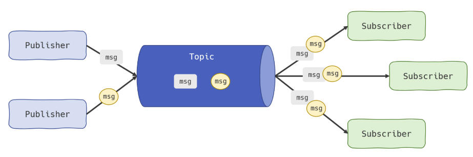
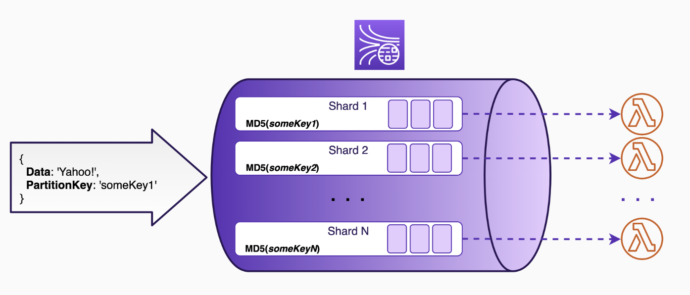
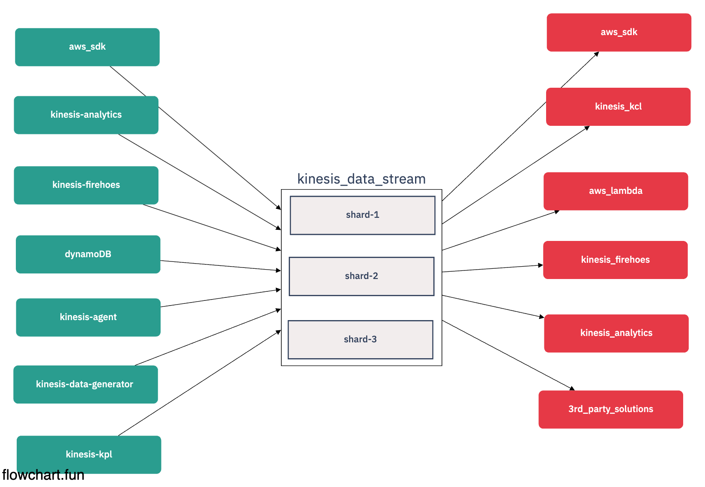

# Kinesis Data-Stream

## DataStream



- 시스템을 분리하는 이벤트 중심 아키텍처를 가능하게 하는 Pattern
- 기본적인 분류는 데이터를 <b>소비</b> App, 데이터를 <b>수집</b> 하는 App을 분리
- Kinesis DataStream은 데이터를 저장할수 있는 Buffer가 존재하기 때문에 많은 양을 보유할 수 있다. (Shard 필요)

## DataStream in Shard



- DataStream은 Shard로 구성되어있다.
- Stream은 샤드라고 불리는 확장가능한 병렬처리 단위로 구성된다.
- 24시간동안 Kinesis Data Stream 보관 <-> 1년 동안 스토리지에 저장가능
- 샤드 자체는 비용이 청구 됨 (저렴하지는 않음)
-
- Shard 2개의 DataStrema + Firehoes 하루에 25,000,000 데이터 처리 가능 (200 ~ 250$)

## DataStream in I/O Limit

- 샤드는 계정당 최대 200개 까지 증설가능 -> 그럴바엔 UnManaged Kafka를 그냥...
- 최대 1MB/Seconds, 1,000 레코드/Seconds 쓰기 및 처리량 존재
- 각 샤드는 <b>GetRecords</b>를 통해서 초당 최대 2MB 읽기속도 제한
- <a href="https://docs.aws.amazon.com/streams/latest/dev/service-sizes-and-limits.html"> I/O Limit or Usage </a>

## Producer and Consumers



## Example 1) Kinesis DataStream + AWS Cli를 활용한 Data Produce

```sh

    alias awk='aws kinesis'

    cd basic-kiensis-data-stream

    ## terraform 실행
    cd infra && terraform init && terraform apply

    ## kinesis for aws-cli 실행
    aws kinesis help

    ## produce-logic 실행
    cd producer-server && pnpm start
```
